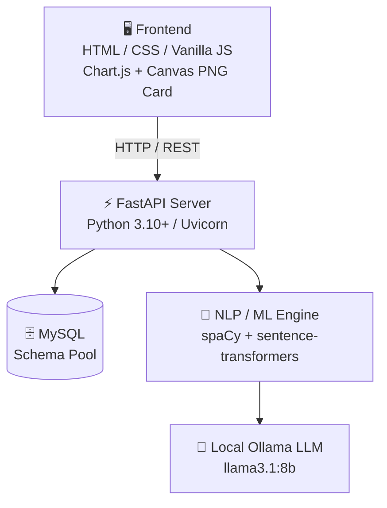

<div align="center">


<h3>Explainable NLP Scoring &nbsp;•&nbsp; Local Generative AI &nbsp;•&nbsp; Recruiter-Grade Insights</h3>

<a href="https://github.com/">
  
</a>

<br/>


<br/>

[**Overview**](#-overview) •
[**Architecture**](#-architecture-overview) •
[**Quick Start**](#-setup--running-instructions) •
[**API**](#-complete-api-sitemap) •
[**Roadmap**](#-complete-phase-status) •
[**Disclosures**](#-judicial--architectural-disclosure-notes)

</div>

---

## ✨ Overview

**MatchPulse** is an enterprise **AI + Data Science** platform designed for **EdTech Course Platforms, Tech Bootcamps, and Enterprise HR Recruiters**.

It pairs two complementary engines:

<table align="center">
  <tr>
    <td align="center" width="50%">
      <h3>🧮 Deterministic NLP Math</h3>
      <sub><code>sentence-transformers</code> embeddings<br/>+ <code>spaCy</code> entity extraction<br/>+ skill alias normalization</sub>
      <br/><br/>
      <b>100% explainable &amp; reproducible match scoring</b>
    </td>
    <td align="center" width="50%">
      <h3>🤖 Local Generative AI</h3>
      <sub><code>Ollama</code> · <code>llama3.1:8b</code><br/>runs fully on your machine</sub>
      <br/><br/>
      <b>Grounded match narratives, tailored interview prep &amp; metric-driven resume rewrites</b>
    </td>
  </tr>
</table>

### 🎯 Key Highlights

| | Feature | What it gives you |
|:-:|---|---|
| 📈 | **Explainable Match Score** | 0–100 score from embeddings + keyword overlap + experience math |
| 🔍 | **Git-Diff Skill Gap View** | Matched vs. missing skills with EdTech learning paths |
| 🎤 | **AI Mock Interviews** | 4–8 tailored technical questions per candidate/JD pair |
| ✍️ | **Bullet Rewriter** | Turns vague resume lines into metric-driven achievements |
| 🧭 | **Career Intelligence** | 5-axis role-fit radar and trajectory prediction |
| 🛡️ | **ATS & Bias Tools** | ATS fidelity meter, recruiter heatmap, demographic bias scanner |
| 📦 | **Bulk Dashboard** | Batch scoring, live resume health editor, shareable PNG cards |

---

## 🏛️ Architecture Overview



<details>
<summary><b>📜 View classic ASCII diagram</b></summary>

```
                    ┌──────────────────────────────────────────┐
                    │   Frontend: HTML / CSS / Vanilla JS      │
                    │   Chart.js CDN + HTML5 Canvas PNG Card   │
                    └────────────────────┬─────────────────────┘
                                         │ HTTP / REST APIs
                                         ▼
                    ┌──────────────────────────────────────────┐
                    │          Backend: FastAPI Server         │
                    │           (Python 3.10+ / Uvicorn)       │
                    └───────┬──────────────────┬───────────────┘
                            │                  │
          ┌─────────────────┴─┐              ┌─┴────────────────┐
          │   MySQL Database  │              │  NLP / ML Engine │
          │  (Schema Pool)    │              │ (sentence-trans) │
          └───────────────────┘              └─┬────────────────┘
                                               │
                                               ▼
                                     ┌──────────────────┐
                                     │ Local Ollama LLM │
                                     │  (llama3.1:8b)   │
                                     └──────────────────┘
```

</details>

### 🧱 Tech Stack

| Layer | Technology |
|---|---|
| **Frontend** | Plain HTML5, Vanilla CSS3, Vanilla JavaScript, Chart.js (CDN) — *zero npm/node build steps* |
| **Backend** | Python **FastAPI** with CORS middleware |
| **Database** | **MySQL** raw schema pool (`mysql-connector-python`) |
| **NLP Engine** | **spaCy** (`en_core_web_sm`) for entities · **sentence-transformers** (`all-MiniLM-L6-v2`) for cosine similarity |
| **Generative AI** | **Ollama** HTTP API (`llama3.1:8b` or `mistral:7b`) for grounded summaries & interview questions |

---

## 🚀 Setup & Running Instructions

> **Prerequisites:** Python 3.10+, MySQL Server, and [Ollama](https://ollama.com/) installed locally.

### 1️⃣ Database Setup (MySQL)

Make sure MySQL Server is running locally, then create the database and apply the schema:

```bash
mysql -u root -p -e "CREATE DATABASE IF NOT EXISTS resume_jd_matcher;"
mysql -u root -p resume_jd_matcher < db/schema.sql
```

Copy the environment configuration file:

```bash
cp .env.example .env
```

> 💡 Update `.env` with your MySQL **user, password, host, and port**.

### 2️⃣ Python Environment Setup

```bash
pip install -r requirements.txt
python -m spacy download en_core_web_sm
```

### 3️⃣ Local LLM Setup (Ollama)

```bash
ollama pull llama3.1:8b
```

### 4️⃣ Run the Backend Server

From the project root directory:

```bash
uvicorn backend.main:app --reload --port 8000
```

| Resource | URL |
|---|---|
| 📘 Swagger Interactive API Docs | <http://localhost:8000/docs> |
| ❤️ Health Check Endpoint | <http://localhost:8000/health> |

### 5️⃣ Run the Frontend

Open `frontend/index.html` directly in any modern browser, **or** serve it via Python:

```bash
python -m http.server 3000 --directory frontend
```

Then visit <http://localhost:3000> 🎉

---

## 🗺️ Complete API Sitemap

| Endpoint | Method | Description |
|---|:-:|---|
| `/health` |  | Health check (DB connection & Ollama liveness) |
| `/upload-jd` |  | Upload or paste Job Description |
| `/upload-resumes` |  | Upload PDF/DOCX/Text candidate resumes |
| `/resumes` |  | List all uploaded candidate resumes |
| `/resume/{id}/parsed` |  | Inspect candidate extracted skills & experience |
| `/jd/{id}/parsed` |  | Inspect target JD required skills & experience |
| `/score/{resume_id}/{jd_id}` |  | Compute 0–100 match score for candidate against JD |
| `/scores/{jd_id}` |  | Candidate leaderboard rankings for target JD |
| `/skill-gap/{resume_id}/{jd_id}` |  | Git-diff match vs missing skills & learning paths |
| `/ai/gap-summary/{resume_id}/{jd_id}` |  | Grounded Ollama LLM natural-language gap narrative |
| `/ai/mock-questions/{resume_id}/{jd_id}` |  | Generate 4–8 tailored technical interview questions |
| `/ai/rewrite-bullet` |  | Metric-driven resume bullet point quantifier |
| `/career-intelligence/{resume_id}` |  | 5-axis multi-role fit radar & career trajectory |
| `/ats/preview/{resume_id}` |  | ATS raw text parsing fidelity & readability meter |
| `/ats/heatmap/{resume_id}` |  | 6-second recruiter visual scan heatmap |
| `/ats/bias-check/{resume_id}` |  | Demographic bias detector & neutral screening scanner |
| `/score-batch/{jd_id}` |  | Batched vector embedding scoring for bulk resumes |
| `/score-live` |  | 300ms debounced live resume health scoring editor |

---

## 📊 Complete Phase Status


| Phase | Name | Highlights | Status |
|:-:|---|---|:-:|
| **0** | Foundation | Skeleton, MySQL schema, FastAPI, static shell | ✅ |
| **1** | Resume / JD Ingestion | PDF (`pdfplumber`), DOCX, text extraction & DB storage | ✅ |
| **2** | Feature Extraction | spaCy `en_core_web_sm`, skill alias taxonomy normalization | ✅ |
| **3** | Scoring Engine | Vector cosine similarity + keyword overlap + experience math | ✅ |
| **4** | Skill-Gap Experience | Git-diff match view, Chart.js bar chart, EdTech learning paths | ✅ |
| **5** | Ollama Generative Layer | Grounded summaries, mock questions, bullet rewriter | ✅ |
| **6** | Career Intelligence | 5-axis role radar, trajectory predictor, unquantified bullet detector | ✅ |
| **7** | ATS & Recruiter Extras | ATS text preview, 6-second heatmap, bias scanner | ✅ |
| **8** | Bulk Dashboard | Batch scoring, live health editor, HTML5 canvas PNG card generator | ✅ |
| **9** | Final Polish & Demo | EdTech enterprise UI pass, `DEMO_SCRIPT.md`, architecture docs | ✅ |

---

## ⚖️ Judicial & Architectural Disclosure Notes

> [!IMPORTANT]
> **Explainable Scoring Math** — Core match scoring is strictly computed by deterministic NLP math (embeddings + keyword overlap + experience formula). The LLM is **never** asked to invent a match score, ensuring 100% reproducible and explainable results.

> [!NOTE]
> **Scannability Proxy** — The 6-second scan simulator uses a layout-density and header-structure proxy algorithm rather than eye-tracking hardware.

> [!NOTE]
> **Demographic Bias Neutrality** — The bias scanner flags non-essential demographic cues (e.g., graduation dates more than 15 years ago, personal status, gender pronouns) to assist blind screening.

---

<div align="center">

### 💙 Built for fair, explainable, and AI-assisted hiring

<sub>If you find MatchPulse useful, consider giving it a ⭐</sub>


</div>
